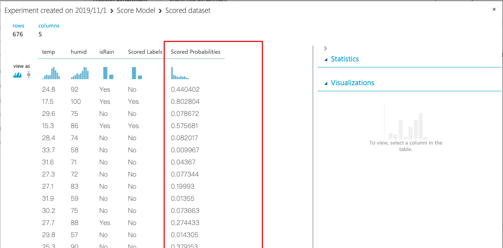
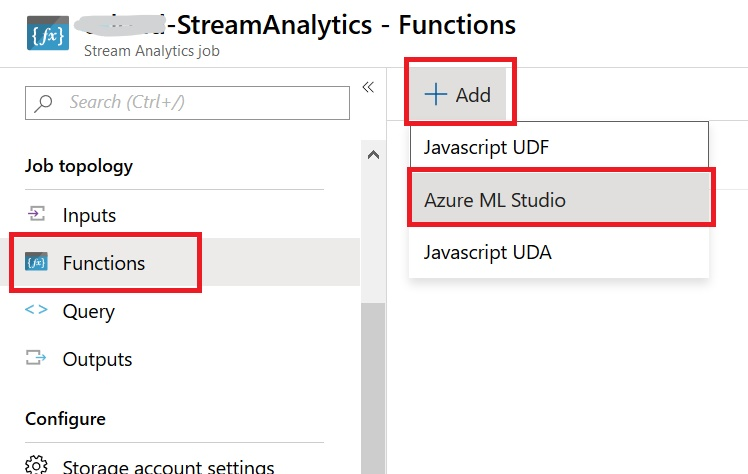
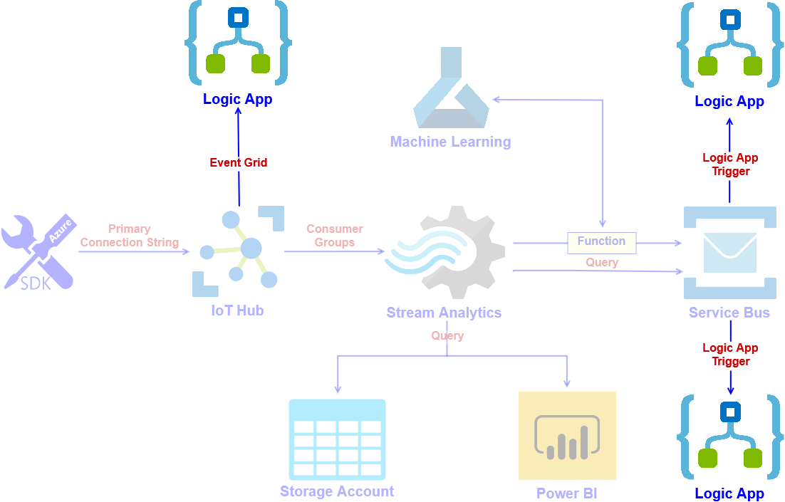
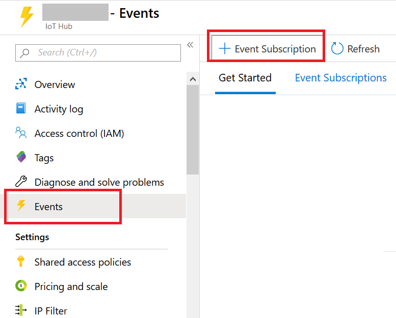
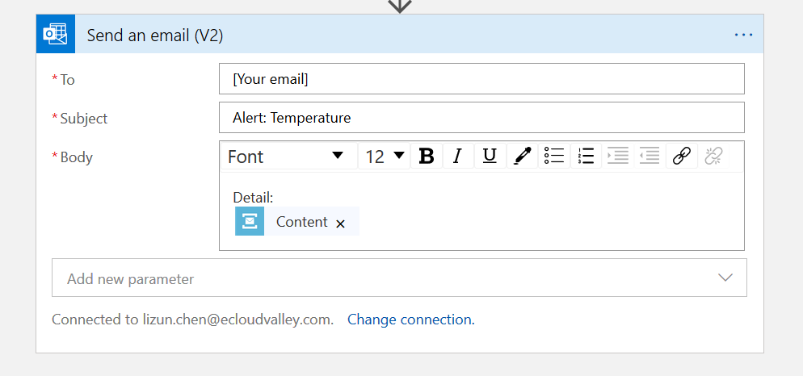
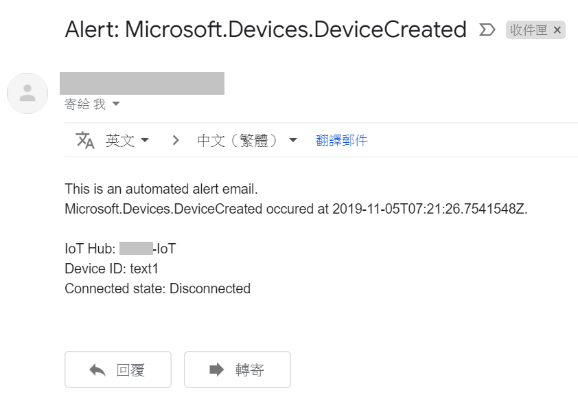

# Combin IoT Hub to build Automated Intelligent email warning system

## Scenario

    

In the tutorial, we will build an Automated Intelligent warning system. 
We will do machine learning studio part first then focus on IoT related deployment. For IoT part we will start with IoT hub, after we deploy the IoT Hub, we will deploy storage account, Service Bus in next step. After that, we will deploy Stream Analytics and connect with IoT Hub with Consumer Groups, which step can let Stream Analytics obtain every data from IoT Device. Stream Analytics can set the rule to analyze the information, if value is too high or low, it will be sended to queue of Service Bus. In the Query, we will use function to combin Machine Learning, you build a model using [Machine Learning Studio](https://docs.microsoft.com/en-us/azure/machine-learning/studio/what-is-ml-studio) that do Weather forecast , and using the temperature and humidity data from  [Azure IoT hub](https://docs.microsoft.com/en-us/azure/iot-hub/about-iot-hub) and [Stream Analytics](https://docs.microsoft.com/en-us/azure/stream-analytics/stream-analytics-introduction) job to prdict rainfall real-time to generate new data and send it to Service Bus. All of data will be send to Storage Account and PowerBI to save and visualize. We have three Logic Apps for three driffent situation. The first one will connect Iot Hub with Event Grid to monitor every device and their connection status. The second and third will monitor the queue of Service Bus. All of them will send email to user when the specified situation occur.

## Prerequisites
* The workshop’s region will be in **"East US"**
* You have **Power BI** account
* You have **available email account**
* You have an Microsoft account with **Office 365**
* Download the file **test.csv**
* Download the file **PythonScript.txt**
* Download the file **Query.txt**
* Download the file **Sample.txt**

## Lab tutorial

### 1. Machine Learning
Build a model using Machine Learning Studio that do Weather forecast, and using the temperature and humidity data from Azure IoT hub and Stream Analytics job to prdict rainfall.

    

#### Create Machine Learning studio workspaces 
1-1. In Azure Portal Search for **Machine Learning Studio workspaces**, click **Add**.

    

    

* For Workspace name, type a **Unique Name**

* Select **Resource Group** to organize your resource, if you don't have one, you can create a new resource group.

* For Location, choose `South Central US`

* For Storage account,select **Use Existing** to organize your Storage account,if you don't have one, you can Select a  **Create new**.

* For Workspace pricing tier,Choose `Standard`

* For Web service plan ,Choose `Create new`

* For Web service plan pricing tier,choose  `S1 Standard`

    

Click **Create** button on lower left side to create Machine Learning studio workspaces  without any setting

#### Launch Machine Learning Studio 

1-2. From the list of vitural machine Learning studio workspaces, click **OverView**

1-3. You can see **Additional Links**,Click `Launch Machine Learning Studio`

    

#### Create a Machine Learning Studio workspace

1-4. Connect to **Azure Machine Learning Studio** Page

    

1-5. Select your workspace in the upper-right-hand corner. 
* Click **Sign In**

    

#### Upload a datasets
1-6. Clicking **+NEW** at the bottom of the Machine Learning Studio window. 

    

1-7. Select **Datasets**

1-8. Click **FROM LOCAL FILE** Upload a new dataset from a local file

    

* On select the data to upload,cilck **Choose File**,upload `test.csv`

* Enter a name for the dataset. For this tutorial, call it **test Data**

* For data type, select **Generic CSV File With no header (.nh.csv)**

    

* Click the **OK** check mark

#### Create an experimen

1-9. In Studio, click **+NEW** at the bottom of the window.

    

1-10. Select **EXPERIMENT**, and then select **Blank Experimen**

    

* Select the default experiment name at the top of the canvas and rename **Weather forecast**

    

1-11. In the module palette to the left of the experiment canvas, click **Saved Datasets**

    

1-12. Find the dataset you created under **My Datasets** and drag it onto the canvas,Select **test.csv**

    

#### Feature Engineering
[Feature engineering](https://en.wikipedia.org/wiki/Feature_engineering) is the process of using **domain knowledge** of the data to create features that make machine learning algorithms work

1-13. Click the output port of the **dataset** and select **Visualize**

    

    

* You can view the first 100 rows of the data and some statistical information for the whole dataset

1-14. Click and drag the **Select Columns in Dataset**  module onto the canvas and drop it below the dataset you added earlier

    

1-15. Click the output port of the dataset  drag to the input port of **Select Columns in Dataset**

    

1-16. click **Select Columns in Dataset** , and in the Properties pane to the right of the canvas, click **Launch column selector**.

    

1-17. In the **Select columns** dialog  Select **With Rules** 
    
* Begin With :**NO Columns**, and Seclect **Iclude** ,**column names** 
   
* Enter column name: `溫度` , `相對溼度`, `降水量`

    

    

#### Edit Metadata

The values and the data types in the dataset are not actually altered; what changes is the [metadata](https://docs.microsoft.com/en-us/azure/machine-learning/studio-module-reference/edit-metadata) inside Azure Machine Learning that tells downstream components how to use the column

1-18. In the module palette, type **metadata** in the Search box

    

1-19. Click and drag the **Edit Metadata** module on to the canvas and drop it below the dataset you added earlier

1-20. Click the output port of the  **Select columns in Dataset**, drag to the input port of **Edit Metadata**

    

1-21. Select **Edit Metadata**, and in the Properties pane to the right of the canvas, click **Launch column selector** , and **New column names** enter text with `temp`, `humd`,`isRain`

    

1-22. In the **Select columns** dialog  Select **BY NAME** 
    
* Begin With :**AVAILABLE COLUMNS**
     * Select column : `溫度`, `相對溼度`, `降水量`
> If you can't select **BY NAME**, select **WITH RULES** and choice `溫度`, `相對溼度`, `降水量` follow the step 4-17.

    

* Click **RUN** under of the experiment

#### Execute Python Script

Inputs to the Python module are exposed as Pandas DataFrames. The `azureml_main` function accepts up to two optional Pandas DataFrames as parameters.

1-23. Find the **Execute Python Script** module, drag it onto the canvas, and connect it to the **Edit Metadata** module

    

1-24. in the Properties pane to the right of the canvas, type:

        # The script MUST contain a function named azureml_main
        # which is the entry point for this module.
        # imports up here can be used to 
        import pandas as pd

        # The entry point function can contain up to two input arguments:
        #   Param<dataframe1>: a pandas.DataFrame
        #   Param<dataframe2>: a pandas.DataFrame
        def azureml_main(dataframe1 = None, dataframe2 = None):
            for i in range(len(dataframe1['isRain'])):
                if  dataframe1['isRain'][i] != 0:
                    dataframe1['isRain'][i] = 'YES'
                else:
                    dataframe1['isRain'][i] = 'NO'
        # Execution logic goes here
            print('Input pandas.DataFrame #1:\r\n\r\n{0}'.format(dataframe1))

        # If a zip file is connected to the third input port is connected,
        # it is unzipped under ".\Script Bundle". This directory is added
        # to sys.path. Therefore, if your zip file contains a Python file
        # mymodule.py you can import it using:
        # import mymodule
        
        # Return value must be of a sequence of pandas.DataFrame
        return dataframe1
> You can check the script in file **PythonScript.txt**

1-25. For Python Version: Select **Anaconda 4.0/python 3.5**

    

 * Click **RUN**  under of the experiment

#### Create training and test datasets

1-26. Find the **Split Data** module, drag it onto the canvas, and connect it to the **Execute Python Script** module

    

1-27. In the Properties pane to the right of the canvas, click:

* Split model:`Spilt Rows`
* Fraction of rows in the first output dataset:`0.7`
* Random seed: `3`
* Stratified split:`False`

    

* Click **RUN**  under of the experiment

#### Train Model 
The **Train Model** in Azure Machine Learning Studio to train a classification or regression model. Training takes place after you have defined a model and set its parameters, and requires tagged data

1-28. In the module palette, expand the **Machine Learning** category to the left of the canvas 

    

1-29. Expand Initialize Mode

1-30. Select the **Two-class Logistic Regression** module under the **classification category**, and drag it to the experiment canvas

    

1-31. Find and drag the **Train Model** module to the experiment canvas. Connect the output of the **Two-class Logistic Regression** module to the left 

1-32. Input of the Train Model module, and connect the output of the **Split Data**  to the right input of the **Train Model**

    

1-33. Click the **Train Model**, click **Launch column selector** in the Properties pane  

    

1-34. Select **BY NAME**
* Select the **isRain** column. **isRain** is the value that our model is going to predict

* Select the **isRain** column in the column selector by moving it from the **Available columns** list to the **Selected columns list**

    

* Click **RUN**  under of the experiment

#### Score Model 

Use the testing data that was separated out by the Split Data module to score our trained models. you can then compare the results of the two models to see which generated better results

 Now that we've trained the model using 70 percent of our data, we can use it to score the other 30 percent of the data to see how well our model functions.

1-35. Find and drag the **Score Model**  to the experiment canvas

    

1-36. Connect the output of the **Train Model**  to the **left input port** of Score Model

1-37. Connect the **test data output (right port) of the Split Data** module to the **right input port** of Score Model

    

1-38. **Run** the experiment and view the output from the **Score Model**

1-39. Clicking the output port of Score Model and select **Visualize**

    

* The output shows the predicted values for **Score probabilities** and the known values from the test data

    

####  Evaluate Model

1-40. Find the **Evaluate Model** module and drag it onto the canvas

    

1-41. Connect the output of the **Score Model**  to the **left input** of Evaluate Model

    

* **Run** the experiment

1-42. View the output from the **Evaluate Model** , click the output port, and then select **Visualize**

    

    

* Metrics for classification models

    * **Accuracy**  : Measures the goodness of a classification model as the proportion of true results to total case

    
    * **Precision**: The proportion of true results over all positive results

    * **Recall**: The fraction of all correct results returned by the model

    
    *  **F-score** : Computed as the weighted average of precision and recall between 0 and 1, where the ideal F-score value is 1

    
    * **AUC** : Measures the area under the curve plotted with true positives on the y axis and false positives on the x axis 

    
    * **Average log loss** : A single score used to express the penalty for wrong results 

    
    * **Training log loss** :  A single score that represents the advantage of the classifier over a random prediction

#### Prepare for deployment
To give others a chance to use the predictive model you've developed in this tutorial, you can deploy it as a web service on Azure.
* Convert the training experiment you've created into a predictive experiment

* Deploy the predictive experiment as a web service

#### Convert the training experiment to a predictive experiment

To get this model ready for deployment, you need to convert this training experiment to a predictive experiment. This involves three steps

1-43. Click **Set Up Web Service**,Select **Predicture Web Service**

    

1-44. In the diagram, drag the Web service **input module** somewhere near the Score Model module

    

1-45. Click **RUN** to validate the steps in the model

1-46. Click DEPLOY **WEB SERVICE** to deploy the model as a web service.

1-47. On the dashboard of the model, download the **Excel 2010 or earlier workbook** for **REQUEST/RESPONSE**

    

1-48. Open the Excel workbook, make a note of the WEB **SERVICE URL** and **ACCESS KEY**

    

### 2. IoT Hub
Deploy an IoT Hub to get the data from IoT Device SDK.

    

#### Create Iot Hub
2-1. Search for **IoT Hub**, click **Add**

2-2.
* Resource Group - Your Resource Group
* Region - East US
* IoT Hub Name - **Your name -IoT**
* Select **Next: Size and scale**
* Select **B1: Basic tier**
    > If you are the only user who use IoT Hub in subscription, you can choice **F1: Free tier**.
* Review and create the resource.

    

    

2-3. Enter your Iot Hub

#### IoT Device
2-4. Under **Explorers**, select **IoT Device**

2-5. Select **New** to add a device.

    

2-6. 
* Device ID - **Your Name + IoTDevice**
* Authentication type - **Symmetric key**
* Check your **Auto-generate keys**
* **Save**

    

2-7.
* Enter your IoT Device
* Save your **Primary Connection String**

    

    

#### Consumer Group
2-8. Back to yout Iot Hub

2-9. Under **Settings**, select **Built-in endpoints**

2-10. Create new consumer group name **ConsumerEndpoint**

2-11. **Save**

    

### 2. Storage Account
Deploy two containers, one for original information, another for Machine learning imformation.

    

#### Create Storage Account
3-1. Search for **Storage Account**, click **Add**

3-2.
* Resource Group - Your Resource Group
* Storage account name - **Your name + iotstorage**
* Location - **East US**

    

3-3. Enter your storage account

#### Create Containers
3-4. In overview, select **Containers**

    

3-5. Create Container for IoT Information
* Select **+Container**
* Name - **Your name + iot**
* Public access level - **Container**

    

3-6. Create second Container for Machine Learning Information
* Select **+Container**
* Name - **Your name + ml**
* Public access level - **Container**

    

### 3. Service Bus
Deploy two queue in service bus to receive data that requires warning.

    

#### Create Service Bus
4-1. Search for **Service Bus**, click **Add**

4-2. Create Namespace
* Name - **Your name -servicebus**
* Pricing tier - Basic
* Resource group - Your Resource group
* Location - East US
* Create

    

4-3. Enter your Service Bus

#### Create Queue
4-4. In overview, select **+Queue**

    

4-5. Create Queue
* Name - **Your name -temperature**
* Max queue size - 1GB
* Create

    

4-6. In overview, find the queue we created, click and enter your queue.

4-7. Under Settings, select **Share access policies**, select **Add**

    

    

4-8. 
* Policy name - **Your name + Policy1**
* Select **Manage**
* Create

    

4-9. Back to Service Bus, and follow the step 4-4 to 4-8 to create the second queue.
* Name - **Your name - ml**
* Policy name - **Your name + Policy2**

    

### 5. Stream Analytics
Receive data from IoT Hub, connect with Machine Learning to analytics the data and send to other resource.

    

#### Create Stream Analytics Jobs
5-1. Search for **Stream Analytics Jobs**, click **Add**

5-2. 
* Job name - **Your name + StreamAnalytics**
* Resource group - Your Resource group
* Location - East US
* Create

    

5-3. Enter your Stream Analytics Jobs

#### Create Input
5-4. Under Job Topology, select **Input**

5-5. Click **Add stream input**, select **IoT Hub**

    

5-6. 
* Input alias - **IotInput**
* Select - Select IoT Hub from your subscriptions
* IoT Hub - **Your name - IoT** (you created in step 2)
* Shared access policy name - **service**
* Consumer Group - **consumerendpoint** (you created in step 2-10)
* Event serialzation format - **JSON**
* Save

    

#### Create Output

5-7. Under Job Topology, select **Output**

#### Output for Service Bus
5-8. Click **Add**, select **Service Bus queue**

    

5-9. The first Output for Service Bus
* Output alias - **TempBusOutput**
* Select - Select queue from your subscriptions
* Service Bus Namespace - **Your name - servicebus** (you created in step 4)
* Queue name - **Your name - temperature** (you created in step 4-5)
* Queue policy name - **Your name + Policy1** (you created in step 4-8)
* Save

    

5-10. Click **Add**, select **Service Bus queue** again

5-11. The second Output for Service Bus
* Output alias - **MLBusOutput**
* Select - Select queue from your subscriptions
* Service Bus Namespace - **Your name - servicebus** (you created in step 4)
* Queue name - **Your name - ml** (you created in step 4-9)
* Queue policy name - **Your name + Policy2** (you created in step 4-9)
* Save

    

#### Output for Blob Storage
5-12. Click **Add**, select **Blob stroage/Data Lake Stroage**

    

5-13. The first Output for Blob Storage
* Output alias - **IoTBlobOutput**
* Select - Select storage from your subscriptions
* Storage account - **Your name + iotstorage** (you created in step 3)
* Container - **Your name + iot** (you created in step 3-5)
* Save

    

5-14. Click **Add**, select **Blob stroage/Data Lake Stroage** again

5-15. The Second Output for Blob Storage
* Output alias - **MLBlobOutput**
* Select - Select storage from your subscriptions
* Storage account - **Your name + iotstorage** (you created in step 3)
* Container - **Your name + ml** (you created in step 3-6)
* Save

    

#### Output for PowerBI
5-16. Click **Add**, select **Power BI**

    

5-17. Under Authorize connection, click **Authorize** to connect your Power BI account.

    

5-18. The Output for PowerBI
* Output alias - **PowerBiOutput**
* Group workspace - **My workspace**
* Dataset name - **AIOTtext**
* Table name - **AIOTtext**
* Authentication mode - **User token**
* Save
> If you can't choice **My workspace** in group workspace, please change Authentication mode to **User token** first, and try again.

    

#### Function
5-19. Under Job Topology, select **Function**

5-20. Click **Add**, select **Azure ML Studio**

    

5-21. The Machine Learning function
* Function alias - **machinelearning**
* Select - **Provide Azure Machine Learning function settings manually**
* URL - From the Excel of Machine learning
* Key - From the Excel of Machine learning
* Save

    

    

#### Edit Query
5-19. Under Job Topology, select **Query**, you can edit your query in right place.

    

5-20. In the right place, type:

    WITH machinelearning AS (
        SELECT EventEnqueuedUtcTime, temperature, humidity, isRain, machinelearning(temperature, humidity, isRain) as result 
        from IotInput
    )

    Select System.Timestamp time, CAST (result.[Scored Probabilities] AS FLOAT ) AS 'probabalities of rain'
    Into MLBusOutput
    From machinelearning
    Where CAST (result.[Scored Probabilities] AS FLOAT ) > 0.5
            
    Select System.Timestamp time, CAST (result.[temperature] AS FLOAT ) AS 'temperature', CAST (result.[humidity] AS FLOAT ) AS 'humidity', CAST (result.[Scored Probabilities] AS FLOAT ) AS 'probabalities of rain'
    Into MLBlobOutput
    From machinelearning

    Select System.Timestamp time, CAST (result.[temperature] AS FLOAT ) AS 'temperature', CAST (result.[humidity] AS FLOAT ) AS 'humidity', CAST (result.[Scored Probabilities] AS FLOAT ) AS 'probabalities of rain'
    Into PowerBiOutput
    From machinelearning

    Select temperature
    Into TempBusOutput
    From IotInput
    Where [temperature] > 30

    Select *
    Into IoTBlobOutput
    From IotInput

> You can find the note in the file **Query.txt**.

    

    

### 6. Logic Apps
Deploy three Logic Apps. The first one will connect Iot Hub with Event Grid to monitor every device and their connection status. The second and third will monitor the queue of Service Bus. All of them will send email to user when the specified situation occur.

    

#### Create Logic Apps
6-1. Search for **Logic Apps**, click **Add**

6-2. Create Logic Apps
* Name - **Your name - IoTDevice-LogicApp**
* Resource group - Your resource group
* Location - East US
* Create

    

6-3. Follow step 6-2, create the other two Logic Apps
* Name - **Your name - ML-LogicApp**
* Name - **Your name - Temperature-LogicApp**

    

#### The Logic App for Iot Hub Device
6-4. Enter the Logic Apps **Your name -IoTDevice-LogicApp**

    

6-5. Enter **Logic Apps Designer**, select **Blank Logic App**.

    

    

>You will enter Logic Apps Designer automatic, if not, select it under **Development Tools**.

6-6. Search **Request** and click it.

    

6-7. Click **Triggers**, find and select **When a HTTP request is received**.

    

6-8. In the new window, select **Use sample payload to generate schema**.

    

6-9. Open file **Sample.txt**, copy and paste on the window. Select **Done** and click **New Step**

    

6-10. Search **office365** and click it.

    

6-11. Click **Actions**, find and select **Send and email(V2)**.

    

6-12. Sign in with an account with Office 365 Output.

    

6-13. Enter your email. Edit the Alert email with Dynamic contents. Select **save**.

    

    

6-14. Click the first block and **copy the HTTP POST URL**.

    

6-15. Enter your Iot Hub, click **Events** and select **+Event Subscription**.

    

    

6-16. Creat Event Subscription
* Name - **Your name + DeviceEvent**
* Event Schema - **Event Grid Schema**
* Filter to Event Types
    * Device Created
    * Device Delete
    * Device Connected
    * Device Disconnected
* Endpoint type - **Web Hook**

    

    

    

* Endpoint - **Select an endpoint**
    * Subscriber Endpoint - The URL you save in step 6-14

    

    

* Create

#### The Logic App for Machine learning

6-17. Enter the Logic Apps **Your name -ML-LogicApp**. Click **Logic Apps Designer** and select **Blank Logic App**

    

6-18. Search and click **Service Bus**

    

6-19. Click **Triggers**, find and select **When one or more massages arrive in queue (auto-complete)**

    

6-20. Create Connection
* Name - **Your name +Connection**
* Service Bus Namespace - The service bus you created in step 3
* Service Bus Policy - Select the preset policy
* Create

    

    

> You only need to create Connection once, the second Logic Apps can use same Connection.

6-21. Choice the queue **Your name -ml**, select **New Step**

    

6-22. Search **office365** and click it.

    

6-23. Click **Actions**, find and select **Send and email(V2)**.

    

6-24. Enter your email. Edit your email. Select **Save**

    

#### The Logic App for Temperature

6-25. Enter the Logic Apps **Your name -Temperature-LogicApp**. Click **Logic Apps Designer** and select **Blank Logic App**

    

6-26. Search and click **Service Bus**

    

6-27. Click **Triggers**, find and select **When one or more massages arrive in queue (auto-complete)**

    

6-28. Choice the queue **Your name -temperature**, select **New Step**

    

6-29. Search **office365** and click it.

    

6-30. Click **Actions**, find and select **Send and email(V2)**.

    

6-31. Enter your email. Edit your email. Select **Save**

    

### 7. Test and Running
#### Create or Delete your IoT Device
7-1. Enter your IoT Hub

7-2. Select IoT Device and try to create and delete some new Device.

    

7-3. Sign in to your email to find the Alert mail.
> Need to wait few minutes.

    

    

#### Start the Stream Analytics
7-4. Enter the website: https://docs.microsoft.com/en-us/azure/iot-hub/iot-hub-raspberry-pi-web-simulator-get-started

7-5. Select **START RASPBERRY PI SIMULATOR**

    

7-6. On line 15, paste your Primary Connection String (Copy in step 1-7.)

    

7-7. Below the line 31, add a new line, and type:

    isRain: Math.floor(Math.random()*2)
    

    

7-8. Enter your Stream Analytics, select **Start, Now, Start**

    

>Wait few minutes until **Created** change to **Running**

7-9. Open the window of RASPBERRY PI SIMULATOR, select **RUN**

#### Storage
7-10 Enter your storage account, select **Containers**

    

7-11. Enter one of the containers, try to find and select the new data

    

7-12. Select Download and review the data.

    

    

7-13. Enter another container, try to find and select the new data

    

7-14. Select Download and review the data.

    

       

#### Email
7-15. Sign in to your email to find the Alert mail.
> Need to wait few minutes.

    

    

    

#### Power BI
7-16. Sign in to your PowerBI on website.
https://powerbi.microsoft.com

7-17. Select **My workspace**, click **Datasets**

    

7-18. Find **AIOTtext**, select **create report**

    

7-19. In Visualizntions, Select **Line chart** to add first line chart. 

7-20. In Fields, Check **Time** and **temperature**  

    

7-21. In Visualizntions, Select **Line chart** to add second line chart. 

7-22. In Fields, Check **Time** and **probabalities of rain**  

    

7-23. Select **File**, **Save**  

7-24. Name - **AIoTtext**, Select **Save**

    

    

7-25. Select **My workspace**, **Report**  

7-26. Find **AIoTtext** and click it

    

7-27. Now you success to finish the tutorial.

    

## Conclusion
Congratulations! You now have learned how to:
* Work in your Machine Learning workspace.

* Connect and edit script in Machine Learning workspace.

* Use Function to connect Machine Learing and Stream Analytics.

* Use Logic Apps to make Automation Email Alert.

* Use Event to connect resource and Logic Apps.

* Use Stream Analytics to process and analyze data from Iot Hub.